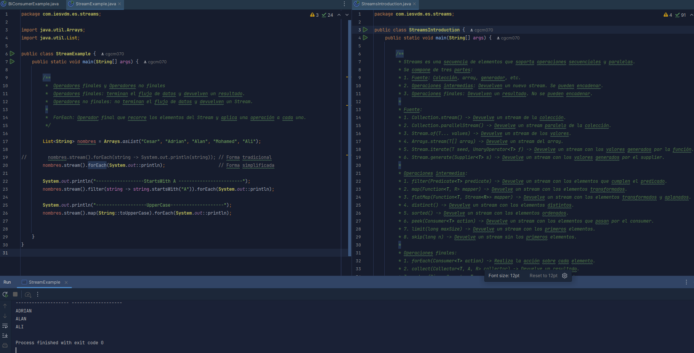

# Streams and Lambda

Este proyecto contiene ejemplos y explicaciones sobre el uso de Streams y Lambdas en Java.

## Estructura del Proyecto

- **Package `lambdas`**: Contiene ejemplos de los diferentes tipos de lambdas.
- **Package `streams`**:
    - `StreamsIntroduction.java`: Explica los conceptos básicos de Streams, incluyendo las fuentes, operaciones intermedias y operaciones finales.
    - `StreamExample.java`: Contiene ejemplos prácticos de operaciones con Streams, como `forEach`, `filter` y `map`.

## Cómo Estudiar con Este Proyecto

1. **Lambdas**: Comienza revisando los ejemplos en el package `lambdas` para entender los diferentes tipos de expresiones lambda y cómo se utilizan en Java.
2. **Streams**:
    - Lee `StreamsIntroduction.java` para familiarizarte con los conceptos básicos de Streams.
    - Revisa `StreamExample.java` para ver ejemplos prácticos de cómo realizar operaciones con Streams.

## Ejemplo de Cómo Estudiar con los Apuntes del Proyecto
